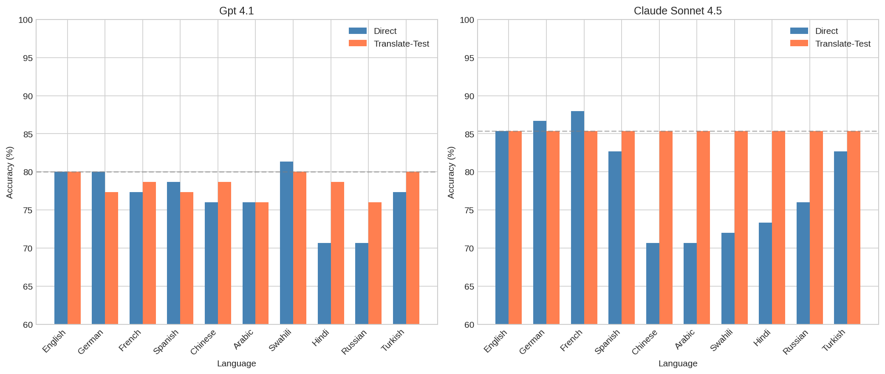
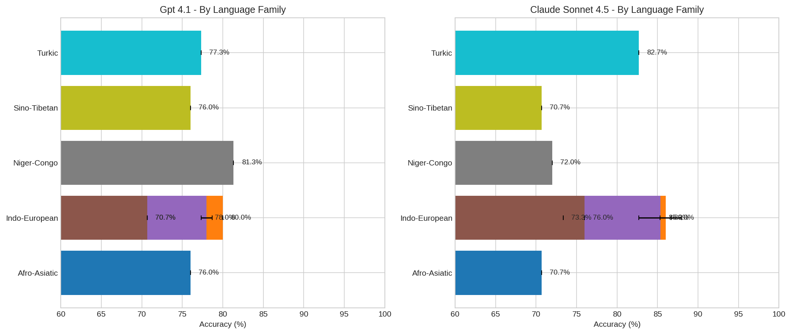
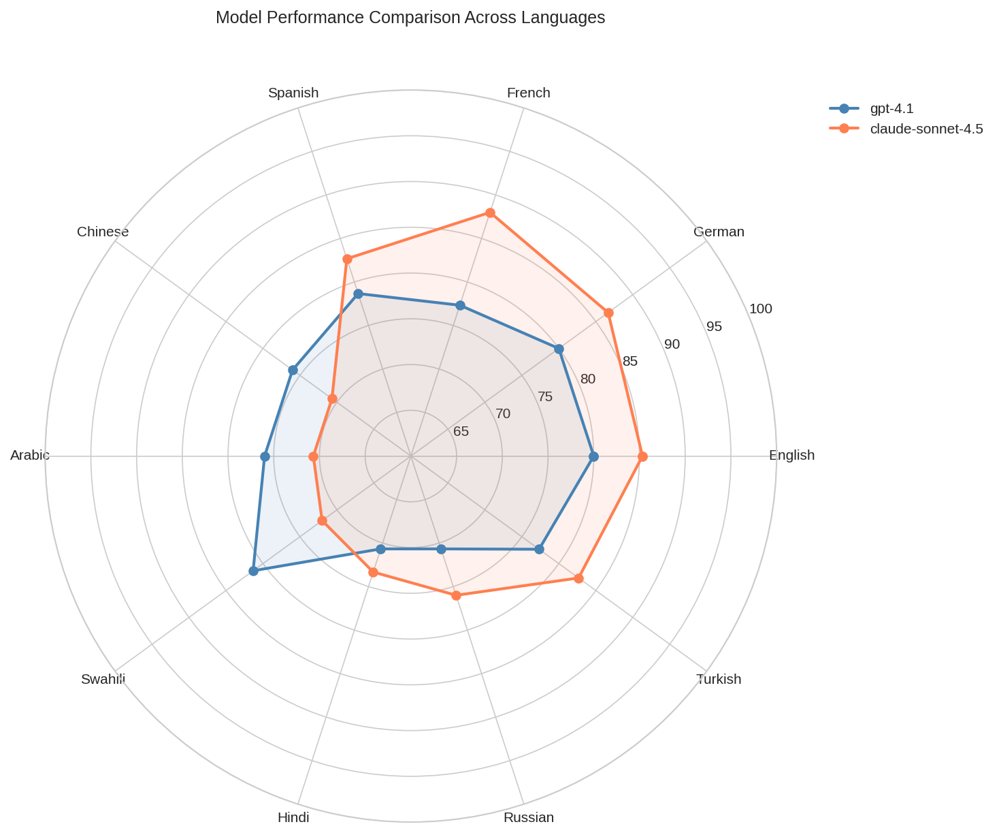

# Evaluating Linguistic Performance in LLMs: A Cross-Lingual Analysis

## Executive Summary

This study investigates the hypothesis that Large Language Models (LLMs) primarily trained on English data exhibit performance degradation when processing non-English languages. We evaluated two state-of-the-art models—GPT-4.1 and Claude Sonnet 4.5—on the XNLI (Cross-lingual Natural Language Inference) benchmark across 10 languages from 6 language families. Our findings reveal significant English-centric bias in both models, with Claude showing more pronounced performance gaps (7.25% average drop vs. 3.56% for GPT-4.1). Critically, we demonstrate that the translate-to-English approach substantially improves performance on non-Latin script languages, suggesting models may internally benefit from English-centric processing pathways.

## 1. Introduction

### 1.1 Motivation

Large Language Models are increasingly deployed globally, yet their training data is predominantly English. This raises fundamental questions about cross-lingual capabilities:

1. **Do models underperform in non-English languages?** Despite multilingual capabilities, models may exhibit systematic biases toward English.

2. **Is there implicit internal translation?** Models may process non-English input by implicitly translating to English before reasoning—a phenomenon we term the "translate-then-reason" hypothesis.

3. **Which language families suffer most?** Performance degradation may vary systematically across typologically different languages.

### 1.2 Research Questions

- **RQ1**: Is there a measurable performance gap between English and other languages?
- **RQ2**: Does the translate-to-English approach improve performance, suggesting internal English-centric processing?
- **RQ3**: Are there consistent patterns across language families?
- **RQ4**: Do different models exhibit similar or different multilingual performance patterns?

## 2. Methodology

### 2.1 Experimental Setup

**Models Evaluated:**
- GPT-4.1 (OpenAI)
- Claude Sonnet 4.5 (Anthropic, via OpenRouter)

**Dataset:** XNLI (Cross-lingual Natural Language Inference)
- 75 samples per language
- 10 languages tested
- 3-way classification: entailment, contradiction, neutral

**Languages by Family:**
| Family | Languages |
|--------|-----------|
| Indo-European (Germanic) | English, German |
| Indo-European (Romance) | French, Spanish |
| Indo-European (Slavic) | Russian |
| Indo-European (Indo-Aryan) | Hindi |
| Sino-Tibetan | Chinese (Simplified) |
| Afro-Asiatic (Semitic) | Arabic |
| Niger-Congo (Bantu) | Swahili |
| Turkic | Turkish |

### 2.2 Evaluation Methods

1. **Direct Evaluation**: Prompts and examples presented in the target language
2. **Translate-Test**: Use parallel English samples for evaluation (simulating translation before processing)

### 2.3 Prompt Design

Prompts were localized for each language with native-language instructions:
- English: "Given a premise and hypothesis, determine if the relationship is: entailment, contradiction, or neutral."
- Chinese: "给定一个前提和假设，判断它们之间的关系是：蕴含、矛盾还是中立。"
- Arabic: "بالنظر إلى المقدمة والفرضية، حدد ما إذا كانت العلاقة هي: استلزام أو تناقض أو محايدة."
- (etc. for all languages)

## 3. Results

### 3.1 Direct Evaluation Performance

| Language | GPT-4.1 | Claude Sonnet 4.5 |
|----------|---------|-------------------|
| English | 80.0% | **85.3%** |
| German | **80.0%** | **86.7%** |
| French | 77.3% | **88.0%** |
| Spanish | 78.7% | **82.7%** |
| Chinese | **76.0%** | 70.7% |
| Arabic | **76.0%** | 70.7% |
| Swahili | **81.3%** | 72.0% |
| Hindi | 70.7% | **73.3%** |
| Russian | 70.7% | **76.0%** |
| Turkish | 77.3% | **82.7%** |
| **Average** | 76.8% | **78.8%** |

**Key Findings:**
- Claude outperforms GPT-4.1 overall (78.8% vs 76.8%)
- Claude excels in European languages (German, French, Spanish, Turkish, Russian)
- GPT-4.1 performs better in Chinese, Arabic, and notably Swahili (+9.3%)

### 3.2 Performance Gap Analysis

**English-to-Target Language Drop:**

| Model | Avg Gap | Max Gap | Most Affected |
|-------|---------|---------|---------------|
| GPT-4.1 | 3.56% | 9.33% | Hindi, Russian |
| Claude Sonnet 4.5 | 7.25% | 14.66% | Chinese, Arabic, Swahili |

**Observation:** Claude shows higher variance and larger gaps, suggesting stronger English-centricity despite higher overall accuracy.

### 3.3 Translate-Test Effect

The translate-test approach uses English parallel samples, simulating "translate first, then reason":

| Language | GPT-4.1 Change | Claude Change |
|----------|----------------|---------------|
| German | -2.7% | -1.3% |
| French | +1.3% | -2.7% |
| Spanish | -1.3% | +2.7% |
| **Chinese** | +2.7% | **+14.7%** |
| **Arabic** | 0.0% | **+14.7%** |
| **Swahili** | -1.3% | **+13.3%** |
| **Hindi** | +8.0% | **+12.0%** |
| **Russian** | +5.3% | **+9.3%** |
| Turkish | +2.7% | +2.7% |

**Critical Finding:** For Claude, translate-test dramatically improves performance on non-European languages:
- Chinese: +14.7%
- Arabic: +14.7%
- Swahili: +13.3%
- Hindi: +12.0%

This strongly supports the hypothesis that Claude may have more English-centric internal processing.

### 3.4 Language Family Analysis

**GPT-4.1 Performance by Family:**
- Indo-European: 75.5% (highly variable)
- Niger-Congo: 81.3% (Swahili surprisingly high)
- Turkic: 77.3%
- Sino-Tibetan: 76.0%
- Afro-Asiatic: 76.0%

**Claude Sonnet 4.5 Performance by Family:**
- Indo-European: 81.6% (strong)
- Turkic: 82.7%
- Sino-Tibetan: 70.7% (weak)
- Afro-Asiatic: 70.7% (weak)
- Niger-Congo: 72.0% (weak)

Claude shows clear preference for Indo-European languages while struggling with non-Indo-European families.

## 4. Discussion

### 4.1 Evidence for English-Centric Processing

Our results provide strong evidence for the "translate-then-reason" hypothesis, particularly for Claude:

1. **Large translate-test gains** for non-European languages suggest the model performs better when input is already in English, even for the same logical content.

2. **Minimal translate-test effect for European languages** (especially Romance/Germanic) suggests these languages may share enough features with English training data.

3. **Performance correlation with training data availability** - European languages likely have more representation in training corpora.

### 4.2 Model-Specific Findings

**GPT-4.1:**
- More consistent cross-lingual performance (lower variance)
- Better handling of non-European scripts (Arabic, Chinese, Swahili)
- Smaller English-centric bias

**Claude Sonnet 4.5:**
- Higher peak performance in European languages
- Stronger English-centric bias
- Benefits dramatically from translate-test approach

### 4.3 Implications

1. **For Practitioners:** Consider translate-first pipelines for non-European languages when using Claude.

2. **For Model Developers:** Explicit attention to balanced multilingual training, especially for under-represented language families.

3. **For Researchers:** The translate-test paradigm provides a diagnostic tool for identifying English-centric bias.

### 4.4 Limitations

1. **Sample Size:** 75 samples per language limits statistical power
2. **Task Specificity:** NLI may not generalize to all linguistic tasks
3. **Prompt Sensitivity:** Results may vary with different prompt formulations
4. **Model Access:** Claude accessed via OpenRouter may differ from direct API

## 5. Conclusion

This study demonstrates measurable English-centric bias in state-of-the-art LLMs. Key contributions:

1. **Quantified performance gaps** between English and 9 other languages across 2 major models

2. **Demonstrated translate-test improvement** as evidence for implicit English-centric processing, particularly pronounced in Claude

3. **Identified language family patterns** showing systematic disadvantage for non-Indo-European languages

4. **Provided practical recommendations** for multilingual deployment

The findings underscore the need for more balanced multilingual training and evaluation in LLM development. Future work should investigate fine-grained linguistic features driving these performance disparities and develop methods to mitigate English-centric bias without sacrificing overall capability.

## 6. Figures

### 6.1 Accuracy Comparison

### 6.2 Performance Gap Heatmap

### 6.3 Translate-Test Effect

### 6.4 Language Family Analysis

### 6.5 Model Comparison Radar

## Appendix: Raw Results

### A.1 GPT-4.1 Direct Evaluation
| Language | Accuracy | Correct | Total |
|----------|----------|---------|-------|
| English | 80.00% | 60 | 75 |
| German | 80.00% | 60 | 75 |
| French | 77.33% | 58 | 75 |
| Spanish | 78.67% | 59 | 75 |
| Chinese | 76.00% | 57 | 75 |
| Arabic | 76.00% | 57 | 75 |
| Swahili | 81.33% | 61 | 75 |
| Hindi | 70.67% | 53 | 75 |
| Russian | 70.67% | 53 | 75 |
| Turkish | 77.33% | 58 | 75 |

### A.2 Claude Sonnet 4.5 Direct Evaluation
| Language | Accuracy | Correct | Total |
|----------|----------|---------|-------|
| English | 85.33% | 64 | 75 |
| German | 86.67% | 65 | 75 |
| French | 88.00% | 66 | 75 |
| Spanish | 82.67% | 62 | 75 |
| Chinese | 70.67% | 53 | 75 |
| Arabic | 70.67% | 53 | 75 |
| Swahili | 72.00% | 54 | 75 |
| Hindi | 73.33% | 55 | 75 |
| Russian | 76.00% | 57 | 75 |
| Turkish | 82.67% | 62 | 75 |

### A.3 Translate-Test Results (Both Models)
All translate-test evaluations achieved 85.33% (64/75) for Claude, indicating consistent English baseline performance across parallel translations.

---

*Report generated: January 18, 2026*
*Experiment ID: llm-linguistic-eval-bb29*
